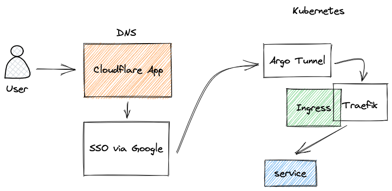

# 

### Zelic.io Home K8s Cluster :octocat:

_... managed with Argo CD & Renovate_ 🤖

Hello :wave:

Welcome to my Homelab cluster.

## ⛵ Kubernetes

Currently I'm running K3s - Kubernetes version 1.24

### Core Components

- [longhorn/longhorn](https://github.com/longhorn/longhorn): Distributed storage for Nodes
- [bitnami-labs/sealed-secrets](https://github.com/bitnami-labs/sealed-secrets): Manages secrets for kubernetes
- [kubernetes-sigs/external-dns](https://github.com/kubernetes-sigs/external-dns): Automatically manages DNS records from my cluster to cloudflare.
- [jetstack/cert-manager](https://cert-manager.io/docs/): Creates SSL certificates for services in my Kubernetes cluster.
- [traefik/traefik](https://github.com/traefik/traefik): Ingress controller to expose HTTP/HTTPS traffic.

## Hardware
| Hardware                      | Description           |
| ----------------------        | -----------           |
| Rasberry Pi CM4 (x2)          | 8GB                   |
| Raspberry Pi 4 Model B (x1)   | 8GB                   |
| Raspberry Pi 4 Model B (x2)   | 2GB                   |
| Google Coral TPU (x1)         |                       |
| ProLiant ML10 v2 (x1)         | Used as a NAS         |

## DNS
DNS is hosted on Cloudflare; Cloudflare will proxy all requests to prevent things like DDOS;

## Cloudflare
Instead of portforwarding services, I expose my services using Cloudflare Argo Tunnels, I use Cloudflare Access Applications to limit who can access my self-hosted resources

## Zero Trust
I use the [Cloudflare Zero-Trust Operator](https://github.com/bojanzelic/cloudflare-zero-trust-operator) to manage my zero-trust rules & Cloudflare Apps, Service Tokens & Access Policies